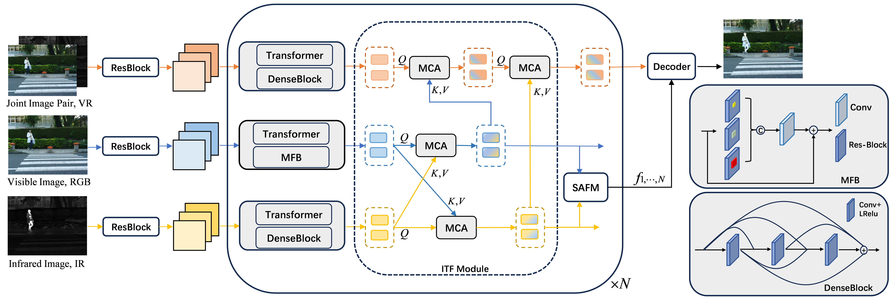
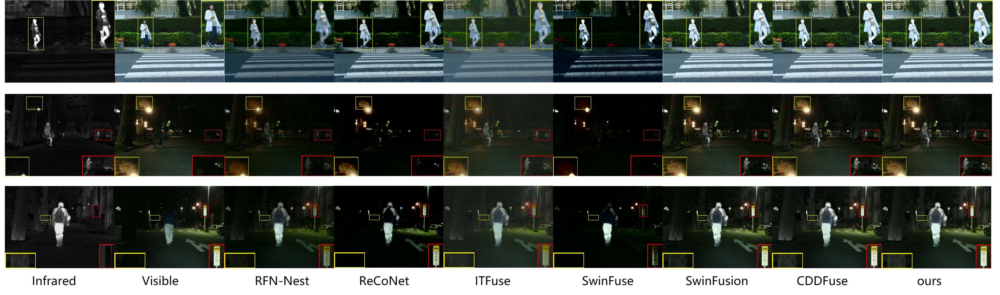

# TSFuse: Triple-Stream Network for Infrared and Visible Image Fusion

## Architecture



## Testing

**1. Pretrained models**

Pretrained models are available in ``'./TSFuse_final.model'`` 

**2. Test datasets**

- Run

```
python test_image.py
```

- Eval
```
python evaluator.py
```

## Training

**1. Data Preparation**

Download the MSRS dataset from [this link](https://github.com/Linfeng-Tang/MSRS) 

**2. Pre-Processing**

- Modify the dataset path and run

```
python dataprocessing.py  
```

and the processed training dataset is named `'MSRS_train_imgsize_128_stride_200.h5'`.

**3. Training**

- Run

```
python train_h5py.py
```

and the trained model is available in `'./models/'`.

or if you do not want to use h5py for training, you can run  
```
python train.py  
```


## Fusion Performance



